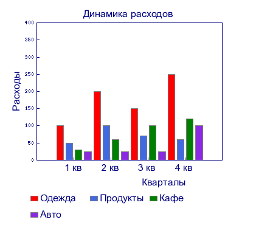
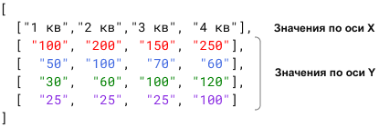

# Как вставить гистограмму в письмо
Гистограмма генерируется на основе данных подписчика и представляет собой сравнение данных в виде групп из столбиков. Для примера рассмотрим гистограмму, которая сравнивает статьи расходов в разные периоды времени:

 <br/>

Гистограмма создаётся в три этапа:
## 1. Создайте поле для хранения координат
Все данные для гистограммы должны храниться в одном поле, поэтому первым делом нужно его создать:
1. В разделе **Подписчики → Анкеты** откройте любую анкету и нажмите «Добавить поле». Обратите внимание, что в системной и базовой анкетах нельзя создавать поля, а в дополнительной анкете мы рекомендуем хранить поля только для социально-демографических данных.
2. Введите название поля, выберите тип «Свободный ввод» и нажмите «Добавить».

Когда поле появится в анкете, скопируйте себе код справа от него — он выглядит вот так: `[% anketa.custom.data %]`. Его нужно будет указать при добавлении гистограммы в письмо.
## 2. Импортируйте значения для гистограммы
Есть два формата записи координат (для наглядности значения каждого столбика выделены тем же цветом, что и сам столбик на гистограмме):

**Запись по строкам (формат bygraph)**<br/>
 <br/>

**Запись по столбцам (формат bypoint)**<br/>
 <br/>

Запомните, какой формат вы выбрали (bygraph или bypoint), — его нужно будет указать при добавлении гистограммы в письмо. У всех получателей гистограммы значения должны быть записаны в одном формате. На внешний вид гистограммы формат не влияет — дело только в удобстве.
:::tip Важно
Так как запись занимает несколько строк, данные в поле анкеты нужно загружать только через API. При импорте через интерфейс значения соберутся в одну строку, и при создании гистограммы возникнет ошибка.

[Как импортировать данные через API](https://sendsay.ru/api/api.html#C%D0%BE%D0%B7%D0%B4%D0%B0%D1%82%D1%8C-%D0%BF%D0%BE%D0%B4%D0%BF%D0%B8%D1%81%D1%87%D0%B8%D0%BA%D0%B0-%D0%9E%D0%B1%D0%BD%D0%BE%D0%B2%D0%B8%D1%82%D1%8C-%D0%B4%D0%B0%D0%BD%D0%BD%D1%8B%D0%B5-%D0%BF%D0%BE%D0%B4%D0%BF%D0%B8%D1%81%D1%87%D0%B8%D0%BA%D0%B0-%D0%9A%D0%94)
:::

Следите, чтобы у получателей были все нужные данные: если для какого-то столбика не указано значение, гистограмма подтянет его из следующего столбика, и значения остальных столбиков тоже съедут. Если у подписчика совсем нет данных, письмо ему отправится без гистограммы.

## 3. Добавьте гистограмму в письмо
Чтобы вставить гистограмму, нужно в HTML-код выпуска вставить фрагмент кода с настройками гистограммы и функцией PROScript. Ниже мы сначала объясним на картинке, за какие настройки отвечают разные строки кода, а ниже дадим код целиком, чтобы его можно было скопировать в письмо.

Для наглядности значения каждого столбика выделены тем же цветом, что и сам столбик на гистограмме.

 <br/>
Код для копирования:
```
[% params = {

"data_format" => "bygraph",

  "type" => "bar",

  "title" => "Динамика расходов",
  "xname" => "Кварталы",
  "yname" => "Расходы",

  "graph" => [

     {"name" => "Одежда"},
     {"name" => "Продукты"},
     {"name" => "Кафе"},
     {"name" => "Авто"},

   ],

  "bar_width" => 4,

  "bar_spacing" => 3,

  "colors" => [
     "#FF0000",
     "#4169E1",
     "#008000",
     "#8A2BE2",
  ],
} %]


```
Перед отправкой выпуска проверьте, как гистограмма отображается в письме:
1. В HTML-редакторе нажмите на иконку любого устройства (под адресной строкой браузера) — откроется режим предпросмотра, который показывает, как будет выглядеть письмо на разных устройствах.
2. Выберите слева пункт «Посмотреть письмо с данными конкретного подписчика», введите почту любого подписчика и нажмите «Применить».