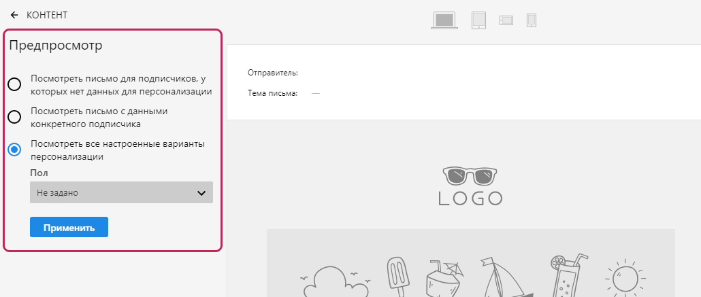
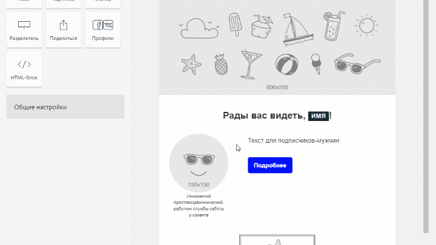
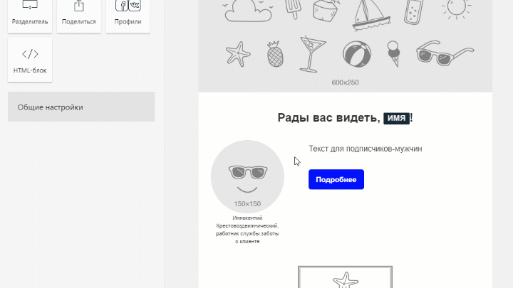

# Как персонализировать рассылку
Вся информация, которую вы собираете о ваших подписчиках, хранится в карточках — от имени и фамилии до истории покупок и интересов. Персонализация позволяет использовать эти данные при создании рассылок, чтобы точнее подстраивать контент письма под каждого подписчика и тем самым увеличить охват и вовлечённость.

Есть два вида персонализации:
- вставить данные в письмо — например, обратиться к подписчику по имени, напомнить количество бонусов или вставить дату рассылки,
- настроить несколько вариантов одного письма (например, на русском и английском языках для подписчиков из разных стран).

[Как отправить письмо на разных языках](./how-to-send-multilanguage-email.mdx) <br/>

Персонализировать рассылку можно как в блочном редакторе, так и в HTML. Если рассылка создана в блочном редакторе, в отчёте по выпуску будет карта кликов по каждому варианту письма.

:::tip Важно
Рекомендуем проверять перед выпуском, правильно ли вы настроили персонализацию. Это можно сделать в режиме предпросмотра — нажмите на любую иконку с изображением гаджетов в верхней части редактора. Слева можно выбрать режим предпросмотра:

 <br/>
:::

## Персонализация в блочном редакторе
### Как вставить данные в письмо
Поставьте курсор на нужное место в тексте — над ним выскочит плашка с настройками. Нажмите «Персонализация» и в выпадающем окне выберите, что нужно вставить:
- дата рассылки (формат ГГГГ-ММ-ДД),
- данные пользователя — в этом случае нужно также указать анкету и поле, где они хранятся.

 <br/>

Также в текст сообщения можно вставить код поля, где хранятся нужные данные, и они автоматически подставятся в письмо. Код можно скопировать в анкете напротив самого поля, выглядит он вот так: ```[% anketa.custom.data %]```

:::tip Важно
Помните, что не у всех получателей есть нужные данные — и те подписчики, у которых не заполнены имена, увидят пропуск в предложении. Чтобы этого избежать, пропишите несколько вариантов приветствия.
:::

### Как настроить несколько вариантов одного письма
Письмо в блочном редакторе состоит из секций. У одной секции может быть несколько вариантов с разным содержанием — в этом случае для каждого варианта нужно указать поле анкеты и конкретное значение этого поля, которое должно быть у его получателя.

Как создать несколько вариантов у секции:

#### 1. Создайте исходный вариант
1. Отредактируйте содержимое секции.
2. Нажмите на секцию — в левой части экрана откроются настройки.
3. Откройте вкладку «Персонализация». Выберите поле и значение, которое должно быть у подписчиков, чтобы увидеть эту секцию.
4. Нажмите «Применить».

 <br/>

#### 2. Создайте дополнительные варианты
1. Нажмите на секцию — в левой части экрана откроются её настройки.
2. Нажмите «Добавить вариант секции». Впишите новое значение поля и нажмите «Применить».
3. Нажмите на секцию, чтобы перейти к настройке контента, и отредактируйте содержимое.

 <br/>

#### 3. Создайте вариант для подписчиков, у которых поле не заполнено или указано некорректное значение (иначе они не увидят эту секцию)
1. Нажмите на секцию — в левой части экрана откроются её настройки.
2. Нажмите «Добавить вариант для получателей у которых не заполнено поле или указаны другие значения».
3. Нажмите на секцию, чтобы перейти к настройке контента, и отредактируйте содержимое.

 <br/>
## Персонализация в HTML
### Как вставить данные в письмо
Чтобы вставить данные, скопируйте в код письма (в HTML-редакторе) или в само письмо (в блочном редакторе) значение поля, где они хранятся:
```
Здравствуйте, [% anketa.base.firstName %]!
```
Если вы обращаетесь к подписчикам по имени, можно добавить функцию PROScript, которая делает первую букву в имени прописной:
```
Здравствуйте, [% ucfirst(anketa.base.firstName) %]!
```
Можно вставить дату в формате ДД.ММ. ГГГГ:
```
[% param.issue.date %]
```
:::tip Важно
Помните, что не у всех подписчиков есть нужные данные, — и они увидят пропуск в предложении. Чтобы этого избежать, рекомендуем прописать вариант для тех, у кого поле не заполнено.
:::
### Как настроить несколько вариантов одного письма
У одного письма может быть несколько вариантов — отличаться могут только приветствия, а может и всё содержимое целиком. Для этого нужно добавить в код письма условные выражения PROScript и для каждого варианта указать поле анкеты и значение, которые должно быть у его получателя.

Условные выражения в PROScript (ссылка)

Рассмотрим самые частые примеры.

Если у поля одно значение, нужно написать два варианта: для тех, у кого оно заполнено, и для тех, у кого информация не указана:

```
[% IF anketa.base.firstName %] Здравствуйте, [% anketa.base.firstName %]!
[% ELSE %] Здравствуйте!
[% END %]
```

Если у поля несколько значений, нужно написать вариант для каждого — например, вот разные приветствия для мужчин и женщин:

```
[% IF anketa.base.gender.keys().0 == '1' %] Уважаемый клиент!
[% ELSIF anketa.base.gender.keys().0 == '0' %] Уважаемая клиентка!
[% ELSE %] Здравствуйте!
[% END %]
```

Если вы хотите разным подписчикам отправить разные письма, то для каждого случая вместо приветствия нужно указать код целиком:

```
[% IF anketa.base.gender.keys().0 == '1' %] Код письма для подписчиков
[% ELSIF anketa.base.gender.keys().0 == '0' %] Код письма для подписчиц
[% ELSE %] Код письма для подписчиков, у которых пол не указан
[% END %]
```


